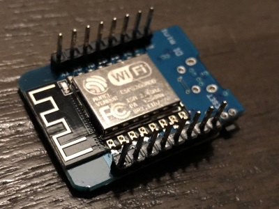
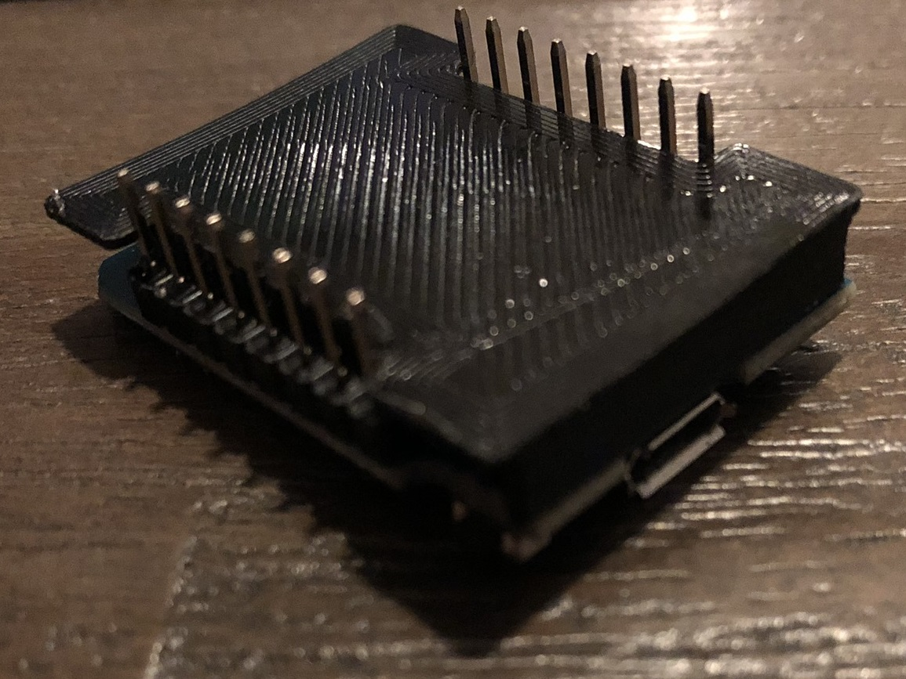
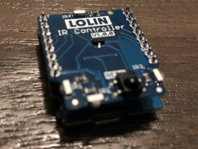
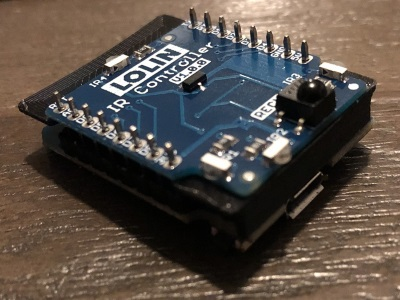
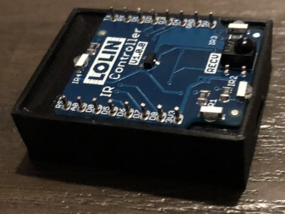
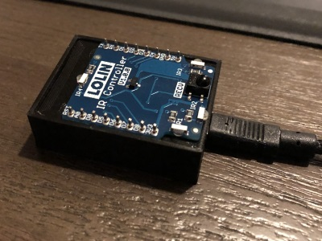

# esp8266-wifi-Pronto-IR

A arduino project that makes it possible to send IR codes over a WiFi connection.
This project will set you back somewhere between 2$ and 4$ and it's super easy to build and use.
If you like this project then please consider a donation: https://www.paypal.me/NielsdeKlerk

## Requirements:

- A Wemos/lolin D1 Mini.
  -- https://wiki.wemos.cc/products:d1:d1_mini
  -- http://tiny.cc/zzvj3y
- A Wemos/lolin IR Controller Shield
  -- https://wiki.wemos.cc/products:d1_mini_shields:ir_controller_shield
  -- https://tinyurl.com/y6oelkry
- A soldering station.
- A USB cable for installing the firmware on the D1 Mini.

## Installation

- Solder the header pins to the Wemos/lolin D1 mini board.

- If you have 3D printed parts you can place the cap.

- Place the IR-Controller shield on top. If you are not using any printed pars then make sure the bottom of the IR-controller isn't touching the aluminum chip shielding. You may want to solder the IR-controller.

- If you have the 3D printed parts then insert the componenct into the box.

- Plug in the USB cable.

- Wait until windows has installed the driver.
- Use the download button here to download the code.
- Extract the code on your computer.
- Open the "Install Wemos D1 mini" folder.
- Open the Install application.
- In the install application select the COM port of the WemosD1
- Select the "Wifi-IR.ino.d1_mini.bin" file.
- Use the Flash button to install the firmware.

## First run.

- Connect your computer or your mobile phone to the wifi network named "Wifi-Ir".
- The wifi connection wizard will automatically open.

## Usage.

### Connect using a brouwser to

http://<ipaddress of wifi-ir>/

### Connect using the API:

http://<ipaddress of wifi-ir>/pronto?code=<PRONTO HEX>

Example:
http://192.168.1.90/pronto?code=0000 006C 0022 0002 015B 00AD 0016 0016 0016 0041 0016 0016 0016 0016 0016 0041 0016 0016 0016 0041 0016 0041 0016 0041 0016 0016 0016 0041 0016 0041 0016 0016 0016 0041 0016 0041 0016 0016 0016 0041 0016 0016 0016 0041 0016 0016 0016 0016 0016 0016 0016 0016 0016 0016 0016 0016 0016 0041 0016 0016 0016 0041 0016 0041 0016 0041 0016 0041 0016 0041 0016 05CB 015B 0057 0016 0E6C

### Connect using a TCP session (telnet)

This is the fastest connection method. (low latency)

- Connect using telnet port 23
- Send the prontoHex and end with a return character (\r)
  Example: 0000 006C 0022 0002 015B 00AD 0016 0016 0016 0041 0016 0016 0016 0016 0016 0041\r

### Discover using mDNS

The code generates a unique hostname. Wifi-IR\_...... where the ...... represent the unique id.
The http based API can be discovered using \_wifi-ir-http.\_tcp.
The telnet based API The hcan be discovered using \_wifi-ir-telnet.\_tcp.
